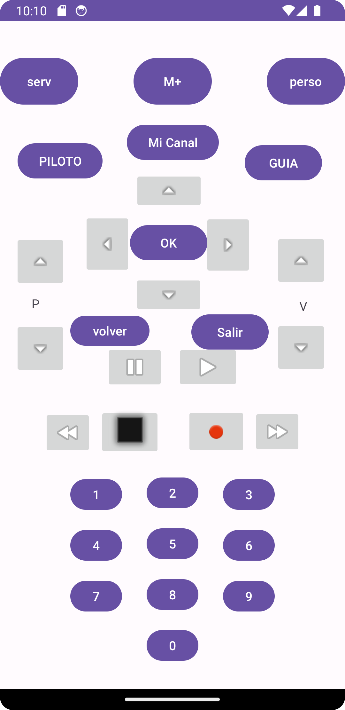

# Control Remoto WiFi para ESP32

## Descripción

Esta es una aplicación de teléfono muy básica que permite controlar un dispositivo ESP32 que actúa como un mando a distancia mediante peticiones HTTP a través de una conexión WiFi. La aplicación tiene una **interfaz gráfica** simple con forma de mando de televisión, en la que cada botón representa una función específica.

Cuando el teléfono está conectado a la red WiFi, cada botón de la interfaz envía una **petición HTTP** a la dirección `http://192.168.0.110`, que es el ESP32 actuando como servidor. Dependiendo del botón presionado, se realizan diferentes solicitudes a rutas como `http://192.168.0.110/Perso` u otras rutas para realizar acciones como cambiar de canal, ajustar el volumen o encender y apagar dispositivos.

### Ejemplo de Rutas HTTP
- `http://192.168.0.110/VOL+"`: Sube el volumen.
- `http://192.168.0.110/VOL-"`: Baja el volumen.
- `http://192.168.0.110/P+`: Cambia al siguiente canal.
- `http://192.168.0.110/Perso`: Función personalizada.

## Complemento al Proyecto ESP32

Este proyecto es el complemento al [proyecto ESP32 en GitHub](https://github.com/xestoso11/esp32/blob/main/emisor_infrarojos/emisor_infrarojos.ino) donde el **ESP32** actúa como un **mando a distancia universal**. El ESP32 está configurado para recibir las peticiones HTTP enviadas desde la aplicación del teléfono, y luego las convierte en señales **infrarrojas** que se envían a los dispositivos controlados, como televisores o sistemas de audio.

La configuración y el código para el ESP32 se pueden encontrar en el repositorio mencionado anteriormente.

## Requisitos
- **Teléfono Android o iOS** conectado a la misma red WiFi que el ESP32.
- **ESP32** configurado como receptor de comandos WiFi que convierte las peticiones en señales infrarrojas, y con ip 192.168.0.110.
- **Dispositivos con control por infrarrojos** (TV, audio, etc.)

## Uso
1. Conecta tu teléfono a la misma red WiFi donde está el ESP32.
2. Abre la aplicación y verás una interfaz gráfica con botones.
3. Al pulsar cualquier botón, se enviará una petición HTTP al ESP32.
4. El ESP32 recibe la petición y convierte el comando en una señal IR que se transmite al dispositivo que quieras controlar.

## Futuras Mejoras
- Añadir soporte para más dispositivos y funciones personalizables.
- Implementar un sistema de configuración desde la aplicación para establecer la dirección IP del ESP32.
- Mejorar la interfaz gráfica para una experiencia más intuitiva.

## Instalación

- Descargar apk de repo y ejecutar.

---

Este proyecto es ideal para aquellos que desean controlar sus dispositivos mediante infrarrojos, pero prefieren usar su teléfono y la red WiFi en lugar de un mando tradicional.

**Contribuciones** y sugerencias son bienvenidas. Para más información sobre el ESP32 y su configuración, visita el repositorio complementario [aquí](https://github.com/xestoso11/esp32/blob/main/emisor_infrarojos/emisor_infrarojos.ino).
